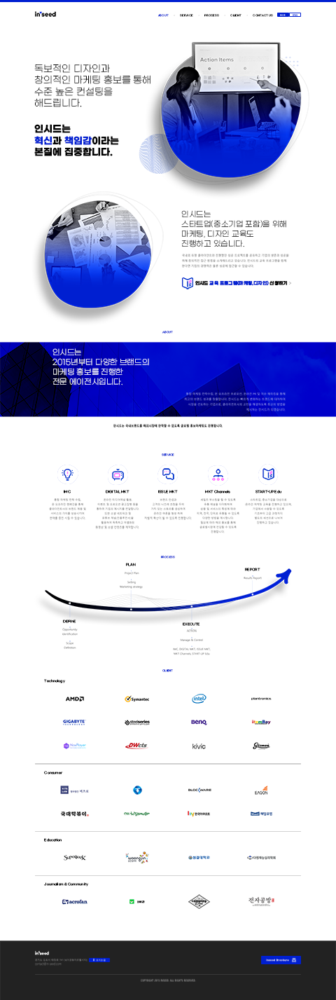
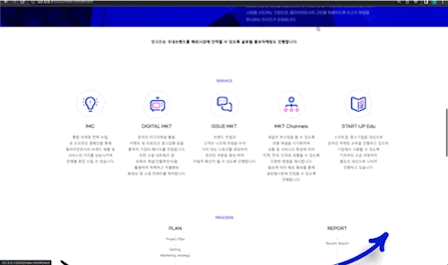

# inseed-homepage

-----------------
인시드 원페이지 홈페이지를 제작하였습니다.

사이트 링크 : https://jun-isaac.github.io/inseed-homepage/

-----------------
## 🧑🏻‍💻 구현 목표

- [x] 헤드 메뉴를 누르면 그 목록으로 자연스러운 스크롤로 이동
- [x] 헤드 메뉴를 마우스를 올리면 글씨 색 변경
- [] footer 오시는길 버튼을 누르면 구글맵 modal창으로 지도앱 켜기


-----------------
## 🖼 메인프레임

* 포토샵 시안을 보고 따라 만든 원페이지 홈페이지
```c
 - 헤더
  - 헤더에 있는 메뉴는 마우스 오버시 메인 컬러로 변경됩니다.
  - 헤더에 있는 메뉴를 누를시 그 영역으로 스크롤 됩니다.
```

## 포토샵 시안


## 완성한 페이지


------------------
## 💻 수정한 것


### 수정 전
- a 태그 안에 href = # 태그는 잘 했지만 영역크기가 지정되어 있지 않아서 클릭을 해도 내려가지 않음




### 수정 후
- 영역크기가 지정하니 # 태그한 영역으로 내려감

------------------
## 📕 배운 것

* div 혹은 section등 영역 크기를 제대로 지정하지 않는다면 a 태그로 그 영역에 가지 못한다.


------------------
## 🔧 수정해야 할 것

* 

------------------
## 🔨 추가해야 할 것

* 스크롤을 내릴시 좌에서 우로 움직이는 화살표

------------------

## 사용 라이브러리
|JavaScript|HTML5|CSS|
|---|---|---|
